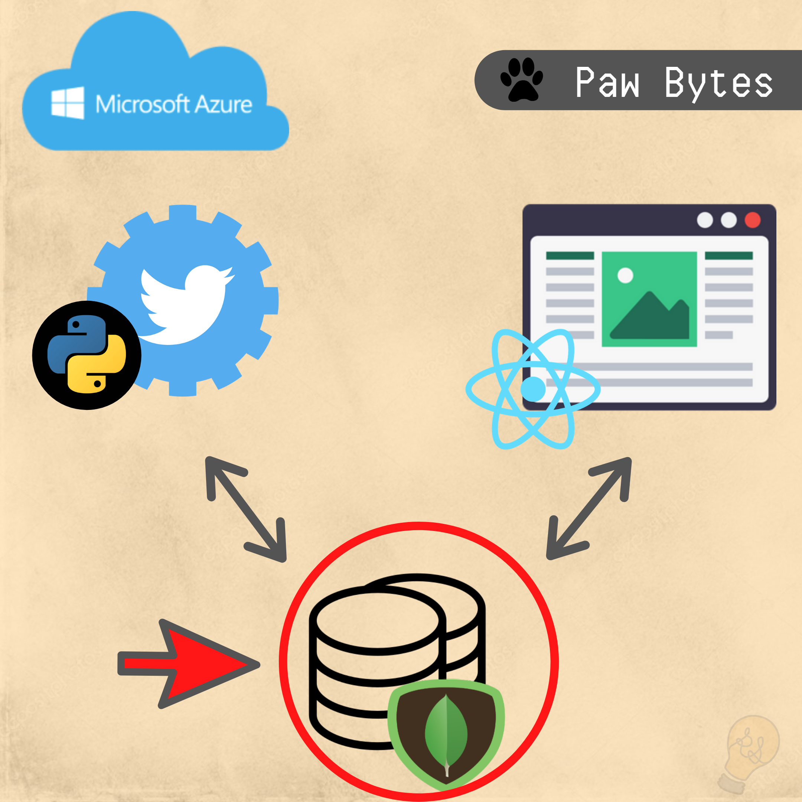
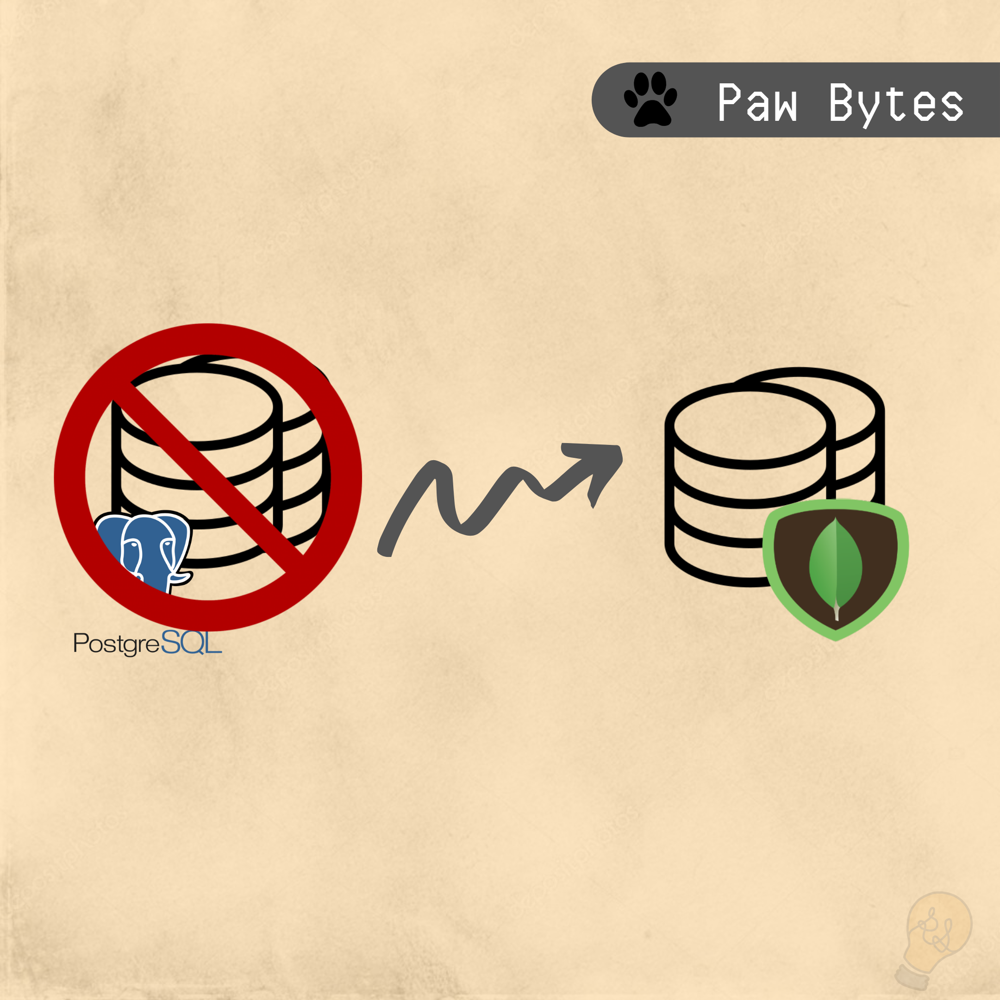
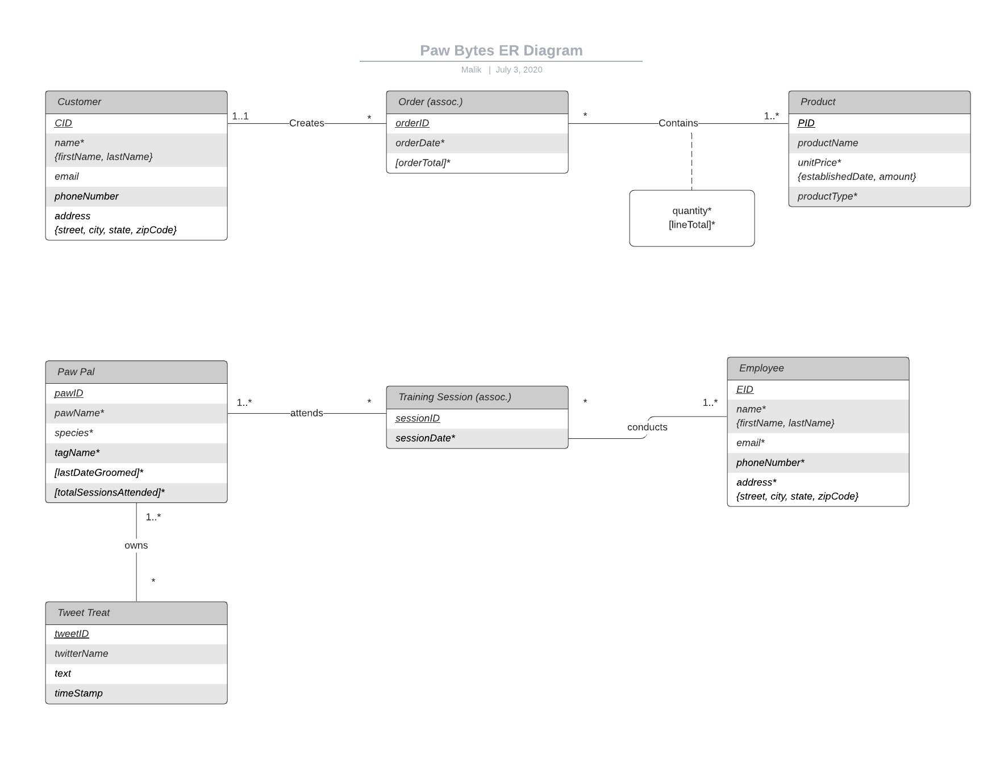
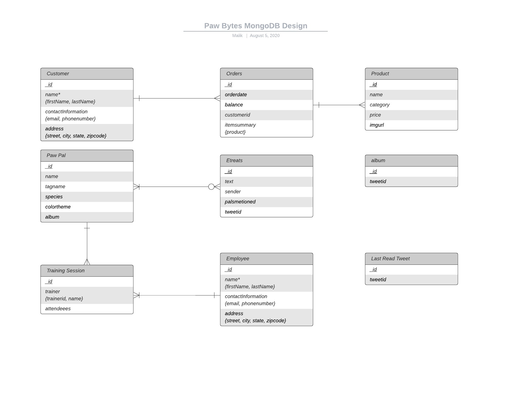

# Paw Bytes Database
Paw Bytes is a three part personal project which models a fictional restaurant.

The three components of this project are
 - [React Web Application](https://github.com/rocstory/PawBytes_WebApp)
 - [Twitter Bot](https://github.com/rocstory/PawBytes_PawBot)
 - [MongoDB Database](https://github.com/rocstory/PawBytes_Database)

Paw Byte's database is an extension of the Paw Bytes Restaurant website. 

## Database  Design
The dataabase was initially created as a relational database, using PostgreSQL. However, after further development, the database was changed to a document-oriented /NoSQL database, MongoDB.

### PostgreSQL
Paw Bytes started off as a DBMS project for a restaurant , however I wanted to take it a step further and make it into a full stack project. 

*** NOTE *** The Diagram show above depicted the old version of Paw Bytes database design

### MongoDB
The transsition from using PostgreSQL to MongoDB was influenced by understanding the most cost-effective way to suppor the project.

## Project Status
- This project is complete.

## Reflection
Creating the database for this project was a great experience. I did not intend to experience building both relational and NoSQL databases within this one project.

### Challenges
- The normalization process within a relational database

## Collaborators
There are currently no collaborators on this project
